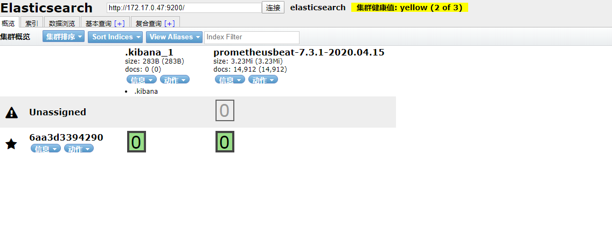
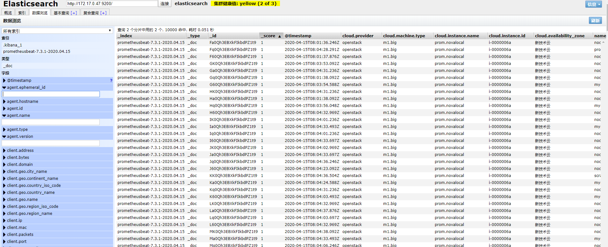

### 1、安装ElasticSearch

```
#查询镜像
# docker search elasticsearch

#拉取镜像
# docker pull elasticsearch:7.5.1

#查看镜像
# docker images 

#运行容器  ，最后为镜像ID
# docker run -d --name elasticsearch  -p 9200:9200 -p 9300:9300 -e "discovery.type=single-node" 2bd69c322e98
```

### 2、安装prometheusbeat

```
#配置文件如下配置如下：

prometheusbeat:
  # Listen port of the server. Defaults to :8080
  listen: ":8080"
  # Context path. Defaults to /prometheus
  context: "/prometheus"
output.elasticsearch:
  # Array of hosts to connect to.
  hosts: ["172.17.0.47:9200"]  # 具体的elasticserch主机IP
  # Optional protocol and basic auth credentials.
  #protocol: "https"
  #username: "elastic"
  #password: "changeme"


# 拉取镜像
# docker pull  infonova/prometheusbeat:latest

# 查看镜像
# docker images

# 运行容器  ，最后为镜像ID
# docker run -d  --name prometheusbeat -p 8080:8080  -v /root/prom/prometheusbeat.yml:/proemtheusbeat.yml  a0be515d0ae5

```

### 3、修改prometheus配置文件

```
remote_write:
  - url: "http://172.17.0.47:8080/prometheus"  # 对应prometheusbeat对应IP
```

### 4、安装成功截图

通过谷歌插件elasticsearch head插件查看



